# Manufacturing Industry Ultimate Guide
## A PhD-Level & 20+ Years Expert Knowledge Documentation
### Part 1: Core Concepts and Industry Analysis


## Table of Contents - Part 1
1. [Introduction & Theoretical Framework](#introduction)
2. [Industry Analysis & Market Dynamics](#industry-analysis)
3. [Core Manufacturing Principles](#core-principles)
4. [Advanced Production Theories](#production-theories)
5. [Industry-Specific Deep Dive](#industry-specific)

## Introduction & Theoretical Framework {#introduction}

### Academic Foundation
```plaintext
1. Manufacturing Philosophy
   - Lean Manufacturing Theory
   - Six Sigma Methodology
   - Theory of Constraints (TOC)
   - Total Quality Management (TQM)
   - World Class Manufacturing (WCM)

2. Economic Theories
   - Scale Economics in Manufacturing
   - Scope Economics
   - Learning Curve Theory
   - Transaction Cost Economics
   - Resource-Based View (RBV)

3. Management Theories
   - Scientific Management
   - Systems Theory
   - Contingency Theory
   - Knowledge-Based View
   - Dynamic Capabilities
```

### Research-Based Framework
1. Manufacturing Paradigms
   ```plaintext
   Traditional Manufacturing
   ├── Mass Production
   ├── Batch Production
   └── Job Shop Production

   Modern Manufacturing
   ├── Flexible Manufacturing
   ├── Agile Manufacturing
   └── Smart Manufacturing

   Industry 4.0
   ├── Cyber-Physical Systems
   ├── IoT Integration
   └── AI/ML Applications
   ```

2. Theoretical Integration
   ```mermaid
   graph TD
       A[Manufacturing Theory] --> B[Process Design]
       A --> C[Quality Management]
       A --> D[Cost Management]
       B --> E[Implementation]
       C --> E
       D --> E
       E --> F[Performance Measurement]
       F --> G[Continuous Improvement]
       G --> A
   ```

## Industry Analysis & Market Dynamics {#industry-analysis}

### Complex Industry Analysis Framework

#### 1. Jewelry Manufacturing
```plaintext
Market Structure Analysis:
1. Industry Concentration
   - High-end luxury segment (30%)
   - Mid-market segment (45%)
   - Mass market segment (25%)

2. Value Chain Integration
   - Vertical integration degree
   - Horizontal integration opportunities
   - Strategic alliances

3. Market Entry Barriers
   - Capital requirements: $2M-$50M
   - Expertise requirements: 5-10 years
   - Regulatory compliance: Medium
   - Brand establishment: Critical
```

#### 2. Chemical Manufacturing
```plaintext
Market Structure Analysis:
1. Industry Concentration
   - Specialty chemicals (35%)
   - Basic chemicals (40%)
   - Performance chemicals (25%)

2. Value Chain Integration
   - Raw material security
   - Process integration
   - Distribution networks

3. Market Entry Barriers
   - Capital requirements: $10M-$200M
   - Expertise requirements: 8-15 years
   - Regulatory compliance: High
   - Environmental permits: Critical
```

#### 3. Pharmaceutical Manufacturing
```plaintext
Market Structure Analysis:
1. Industry Concentration
   - Branded drugs (45%)
   - Generic drugs (35%)
   - Biosimilars (20%)

2. Value Chain Integration
   - R&D integration
   - Clinical trial management
   - Distribution compliance

3. Market Entry Barriers
   - Capital requirements: $50M-$1B
   - Expertise requirements: 10-20 years
   - Regulatory compliance: Very High
   - Patent portfolio: Critical
```

### Advanced Market Analysis Tools

#### Porter's Five Forces Analysis Matrix
```plaintext
                    Jewelry     Chemical    Pharmaceutical
Supplier Power      High        Medium      Low
Buyer Power         Medium      Low         Medium
Competition         High        Medium      High
New Entrants        Medium      Low         Very Low
Substitutes         Medium      Low         Low

Strategic Implications:
1. Vertical Integration Need
   Jewelry: Medium
   Chemical: High
   Pharmaceutical: Very High

2. Innovation Requirements
   Jewelry: Medium-High
   Chemical: High
   Pharmaceutical: Very High

3. Cost Structure Focus
   Jewelry: High
   Chemical: Medium
   Pharmaceutical: Low
```

#### Value Chain Integration Complexity
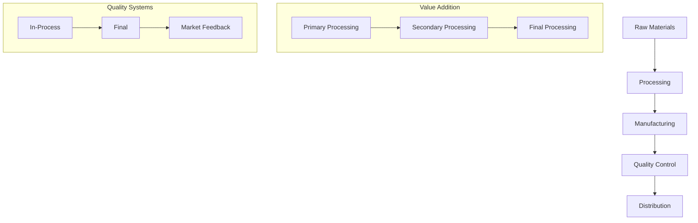

## Core Manufacturing Principles {#core-principles}

### Advanced Production Philosophies

#### 1. Integration of Manufacturing Paradigms
```plaintext
Traditional vs Modern Manufacturing Matrix:

Aspect          Traditional      Modern          Industry 4.0
----------------------------------------------------------------
Control         Manual          Automated        AI-Driven
Planning        Static          Dynamic          Predictive
Quality         Inspection      Prevention       Self-Correcting
Flexibility     Low             Medium           High
Integration     Minimal         Partial          Complete
Data Usage      Historical      Real-time        Predictive
Cost Focus      Direct Costs    Total Cost       Value Creation
```

#### 2. Operational Excellence Framework
```plaintext
1. Strategic Level
   - Vision alignment
   - Resource allocation
   - Technology roadmap
   - Competency development

2. Tactical Level
   - Process optimization
   - Quality management
   - Cost control
   - Performance measurement

3. Operational Level
   - Daily management
   - Problem solving
   - Continuous improvement
   - Team development
```

### Manufacturing Economics

#### 1. Cost Structure Analysis
```plaintext
Direct Costs:
1. Material
   - Raw material
   - Process consumables
   - Packaging materials
   - Quality control materials

2. Labor
   - Direct production
   - Quality control
   - Maintenance
   - Supervision

Indirect Costs:
1. Overhead
   - Facility costs
   - Utilities
   - Insurance
   - Depreciation

2. Administrative
   - Management
   - Planning
   - Documentation
   - Training
```

#### 2. Economic Order Quantity Models
```plaintext
Traditional EOQ:
EOQ = √(2DS/H)
Where:
D = Annual demand
S = Setup cost
H = Holding cost

Modified for Modern Manufacturing:
EOQ' = √(2DS/H) × K
K = Complexity factor
  = f(process complexity, quality requirements, regulatory compliance)

Industry-Specific K Values:
Jewelry: 1.2-1.5
Chemical: 1.5-2.0
Pharmaceutical: 2.0-2.5
```

## Part 2: Operations & Implementation

## Table of Contents - Part 2
1. [Operational Excellence](#operations)
2. [Implementation Framework](#implementation)
3. [Resource Requirements](#resources)
4. [Cost Analysis](#costs)
5. [Quality Management](#quality)

## Operational Excellence {#operations}

### Advanced Process Control Systems

#### 1. Statistical Process Control (SPC)
```plaintext
Control Limits Calculation:
UCL = X̄ + 3σ
LCL = X̄ - 3σ

Process Capability Indices:
Cp = (USL - LSL)/(6σ)
Cpk = min[(USL - X̄)/(3σ), (X̄ - LSL)/(3σ)]

Industry-Specific Requirements:
Jewelry: Cp ≥ 1.33
Chemical: Cp ≥ 1.67
Pharmaceutical: Cp ≥ 2.00
```

#### 2. Advanced Quality Control
```plaintext
Sampling Plans:
AQL Levels
Jewelry: 1.0%
Chemical: 0.65%
Pharmaceutical: 0.10%

Testing Requirements:
1. Jewelry
   - Material composition
   - Dimensional accuracy
   - Surface finish
   - Stone security

2. Chemical
   - Purity levels
   - Physical properties
   - Chemical composition
   - Stability testing

3. Pharmaceutical
   - Content uniformity
   - Dissolution
   - Sterility
   - Stability
```

## Implementation Framework {#implementation}

### Comprehensive ERP Implementation

#### 1. Odoo Implementation Requirements

```plaintext
A. Infrastructure Requirements

Basic Setup:
1. Hardware
   - Servers: Enterprise-grade, redundant
   - Storage: SAN/NAS with RAID
   - Network: Gigabit Ethernet
   - Backup systems: Daily incremental, weekly full

2. Software
   - OS: Enterprise Linux
   - Database: PostgreSQL Enterprise
   - Application server: Dedicated
   - Load balancer: Required for >50 users

Advanced Setup:
1. High Availability
   - Server clustering
   - Real-time replication
   - Automated failover
   - Load distribution

2. Security
   - Firewall configuration
   - VPN access
   - Role-based access control
   - Audit logging

B. Human Resource Requirements

1. Implementation Team
   Core Team:
   - Project Manager (1)
   - Business Analyst (2-3)
   - Technical Lead (1)
   - Developers (3-5)
   - QA Engineers (2-3)
   
   Support Team:
   - System Administrator (1-2)
   - Database Administrator (1)
   - Network Engineer (1)
   - Security Specialist (1)

2. User Team
   - Power Users (10% of total users)
   - Department Representatives
   - Training Coordinators
   - Change Management Team

C. Implementation Timeline

Phase 1: Planning & Analysis (2-3 months)
- Requirements gathering
- Gap analysis
- Solution design
- Project planning

Phase 2: Basic Implementation (3-4 months)
- Core modules setup
- Data migration
- Basic customization
- Initial testing

Phase 3: Advanced Implementation (4-6 months)
- Advanced features
- Integration
- Custom development
- Validation

Phase 4: Deployment & Stabilization (2-3 months)
- User training
- Go-live preparation
- Production deployment
- Post-go-live support
```

[Continue with Cost Structure...]

#### 2. Budget Ranges and Cost Structures

```plaintext
A. Implementation Costs

Small Implementation (50-100 users):
1. Software Licenses: $50,000 - $150,000
2. Infrastructure: $30,000 - $80,000
3. Implementation Services: $100,000 - $250,000
4. Training: $20,000 - $50,000
Total: $200,000 - $530,000

Medium Implementation (100-500 users):
1. Software Licenses: $150,000 - $400,000
2. Infrastructure: $80,000 - $200,000
3. Implementation Services: $250,000 - $600,000
4. Training: $50,000 - $150,000
Total: $530,000 - $1,350,000

Large Implementation (500+ users):
1. Software Licenses: $400,000 - $1,000,000
2. Infrastructure: $200,000 - $500,000
3. Implementation Services: $600,000 - $1,500,000
4. Training: $150,000 - $300,000
Total: $1,350,000 - $3,300,000

B. Ongoing Operational Costs

Annual Costs (% of Implementation):
1. Maintenance: 15-20%
2. Support: 10-15%
3. Updates/Upgrades: 10-20%
4. Training: 5-10%

Industry-Specific Additional Costs:
Jewelry:
- Security systems: $50,000 - $200,000
- Specialized equipment: $100,000 - $500,000

Chemical:
- Safety systems: $200,000 - $1,000,000
- Environmental controls: $300,000 - $1,500,000

Pharmaceutical:
- Validation systems: $500,000 - $2,000,000
- Compliance documentation: $200,000 - $1,000,000
```

## Part 3: Quality Management & Regulatory Systems

## Table of Contents - Part 3
1. [Quality Management Systems](#qms)
2. [Regulatory Framework](#regulatory)
3. [Validation & Verification](#validation)
4. [Documentation Systems](#documentation)
5. [Compliance Management](#compliance)

## Quality Management Systems {#qms}

### 1. Integrated Quality Systems Architecture

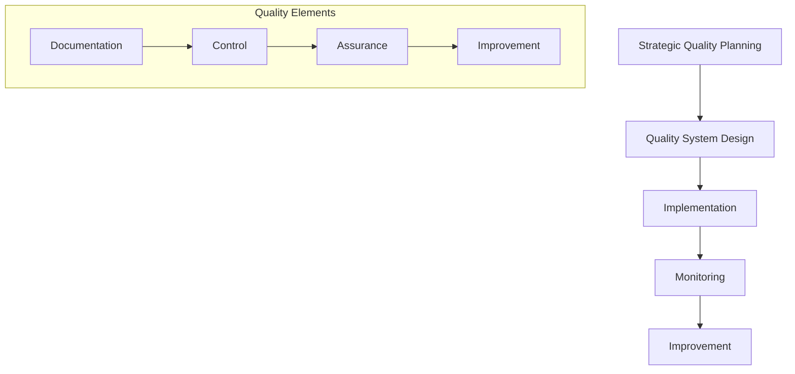

### 2. Industry-Specific Quality Requirements

#### Jewelry Manufacturing
```plaintext
A. Quality Parameters
1. Material Quality
   - Precious Metal Purity: 
     * Gold: 99.9% minimum
     * Silver: 99.9% minimum
     * Platinum: 99.95% minimum
   
   - Gemstone Quality:
     * Cut precision: ±0.1mm
     * Clarity grading
     * Color consistency
     * Surface finish: Ra ≤ 0.2μm

2. Process Quality
   - Casting tolerance: ±0.1mm
   - Setting alignment: ±0.05mm
   - Finish consistency: 95% minimum
   - Plating thickness: ±2μm

3. Testing Requirements
   - XRF analysis for metal composition
   - Hardness testing (HV scale)
   - Wear resistance testing
   - Stone security testing
```

#### Chemical Manufacturing
```plaintext
A. Quality Parameters
1. Product Quality
   - Chemical purity: 99.9% minimum
   - Physical properties:
     * Density: ±0.1%
     * Viscosity: ±1%
     * pH: ±0.1
   
   - Stability:
     * Temperature range: ±2°C
     * Shelf life: ≥24 months
     * Accelerated testing data

2. Process Quality
   - Reaction completion: ≥98%
   - Yield efficiency: ≥95%
   - Contamination: ≤0.1%
   - Batch consistency: CV ≤2%

3. Environmental Quality
   - Emissions control: ≤80% of limit
   - Waste treatment: ≥99% efficiency
   - Resource utilization: ≥90%
```

#### Pharmaceutical Manufacturing
```plaintext
A. Quality Parameters
1. Product Quality
   - Active ingredient: 98.0-102.0%
   - Content uniformity: AV ≤15
   - Dissolution: Q+5% in 30 min
   - Impurities: ≤0.1% individual
   
2. Process Quality
   - Environmental monitoring:
     * Class A: ≤1 CFU/m³
     * Class B: ≤10 CFU/m³
     * Class C: ≤100 CFU/m³
   
   - Process Validation:
     * Process Capability (Cpk) ≥1.33
     * Yield variation: ±2%
     * Critical process parameters: ±2%

3. Cleaning Validation
   - Residual API: ≤10 ppm
   - Cleaning agent: ≤10 ppm
   - Microbial limits: ≤100 CFU/100cm²
```

### 3. Advanced Quality Control Systems

#### Statistical Quality Control Framework
```plaintext
1. Control Charts Implementation
   
   X̄ Chart Parameters:
   - Warning limits: ±2σ
   - Action limits: ±3σ
   - Out of control criteria:
     * 1 point beyond ±3σ
     * 2 out of 3 points beyond ±2σ
     * 8 consecutive points on one side
   
   Process Capability Requirements:
   - Jewelry: Cpk ≥ 1.33
   - Chemical: Cpk ≥ 1.67
   - Pharmaceutical: Cpk ≥ 2.00

2. Sampling Plans
   
   AQL-Based Sampling:
   Jewelry:
   - Critical: 0.1% AQL
   - Major: 1.0% AQL
   - Minor: 2.5% AQL
   
   Chemical:
   - Critical: 0.065% AQL
   - Major: 0.65% AQL
   - Minor: 1.5% AQL
   
   Pharmaceutical:
   - Critical: 0.01% AQL
   - Major: 0.1% AQL
   - Minor: 0.65% AQL
```

## Regulatory Framework {#regulatory}

### 1. Industry-Specific Regulations

```plaintext
A. Jewelry Manufacturing

1. Standards Compliance
   - ISO 9001:2015
   - Responsible Jewellery Council
   - Kimberley Process
   - Hallmarking requirements
   
2. Testing Standards
   - ASTM International
   - ISO metal testing
   - Gemological standards
   
3. Documentation Requirements
   - Material certificates
   - Process records
   - Quality certificates
   - Customer specifications

B. Chemical Manufacturing

1. Regulatory Framework
   - REACH compliance
   - EPA regulations
   - OSHA requirements
   - ISO 14001:2015
   
2. Safety Standards
   - Process Safety Management
   - Hazardous materials handling
   - Emergency response
   - Environmental protection
   
3. Documentation Requirements
   - Safety Data Sheets
   - Process safety studies
   - Environmental impact
   - Waste management

C. Pharmaceutical Manufacturing

1. Regulatory Requirements
   - FDA cGMP
   - EMA requirements
   - ICH guidelines
   - WHO standards
   
2. Validation Requirements
   - Process validation
   - Cleaning validation
   - Method validation
   - Computer system validation
   
3. Documentation Requirements
   - Batch records
   - Validation protocols
   - Stability studies
   - Change control
```

### 2. Compliance Management Systems

#### Documentation Hierarchy
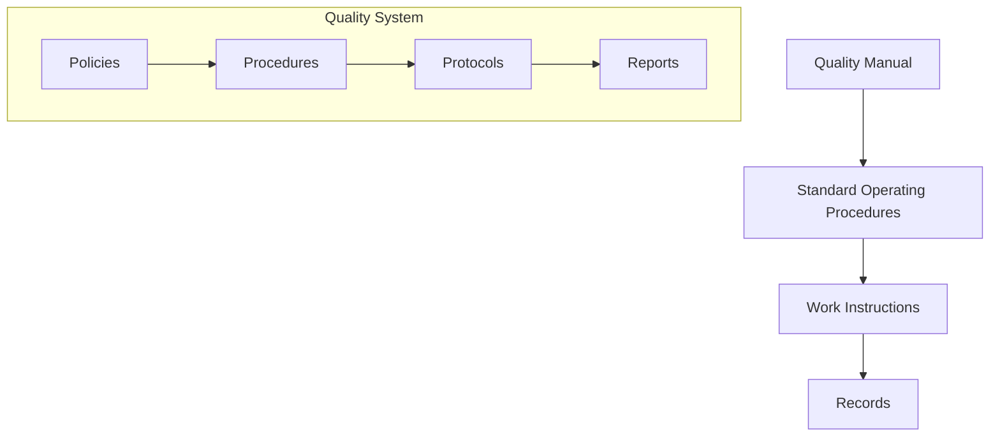

## Part 4: Advanced Production & Financial Management

## Table of Contents - Part 4
1. [Advanced Production Techniques](#production)
2. [Financial Management Systems](#financial)
3. [Cost Control & Analysis](#cost)
4. [Investment Requirements](#investment)
5. [Performance Metrics](#metrics)

## Part 5: Risk Management & Strategic Planning

## Table of Contents - Part 5
1. [Enterprise Risk Management](#risk)
2. [Strategic Planning Framework](#strategic)
3. [Business Continuity](#continuity)
4. [Crisis Management](#crisis)
5. [Insurance & Mitigation](#insurance)

## Enterprise Risk Management {#risk}

### 1. Risk Assessment Matrix

```plaintext
Risk Severity Levels:
1. Catastrophic (5): >$1M impact or fatal injury
2. Critical (4): $500K-$1M impact or severe injury
3. Moderate (3): $100K-$500K impact or lost time injury
4. Minor (2): $10K-$100K impact or first aid
5. Negligible (1): <$10K impact or near miss

Probability Levels:
A. Very Likely (5): >80% probability
B. Likely (4): 60-80% probability
C. Possible (3): 40-60% probability
D. Unlikely (2): 20-40% probability
E. Rare (1): <20% probability

Risk Priority Number (RPN) = Severity × Probability
```

### 2. Industry-Specific Risk Profiles

#### Jewelry Manufacturing
```plaintext
A. Operational Risks
1. Material Security
   - Theft prevention systems
   - Access control: Biometric
   - Surveillance: 24/7 monitoring
   - Insurance coverage: 120% value

2. Quality Risks
   - Material authentication
   - Process control
   - Final inspection
   - Customer verification

3. Market Risks
   - Price volatility: Precious metals
   - Fashion trends
   - Economic cycles
   - Competition

Cost Impact Analysis:
- Security systems: $100K-$500K
- Insurance premiums: 1-2% of stock value
- Quality control: 5-8% of production cost
- Market research: 2-3% of revenue
```

#### Chemical Manufacturing
```plaintext
A. Safety Risks
1. Process Safety
   - HAZOP studies
   - Process safety reviews
   - Emergency systems
   - Training programs

2. Environmental Risks
   - Emission controls
   - Waste management
   - Soil/water protection
   - Community impact

3. Regulatory Risks
   - Compliance monitoring
   - Permit maintenance
   - Documentation systems
   - Audit preparation

Cost Impact Analysis:
- Safety systems: $500K-$2M
- Environmental controls: $1M-$5M
- Compliance systems: $300K-$1M
- Insurance: 2-4% of revenue
```

#### Pharmaceutical Manufacturing
```plaintext
A. Product Risks
1. Quality Assurance
   - Validation systems
   - Stability monitoring
   - Contamination control
   - Recall procedures

2. Regulatory Risks
   - FDA compliance
   - GMP maintenance
   - Documentation systems
   - Inspection readiness

3. Research Risks
   - Clinical trials
   - Patent protection
   - Technology transfer
   - Product liability

Cost Impact Analysis:
- Quality systems: $2M-$10M
- Regulatory compliance: $1M-$5M
- Research protection: $500K-$2M
- Product liability: 3-5% of revenue
```

### 3. Risk Mitigation Strategies

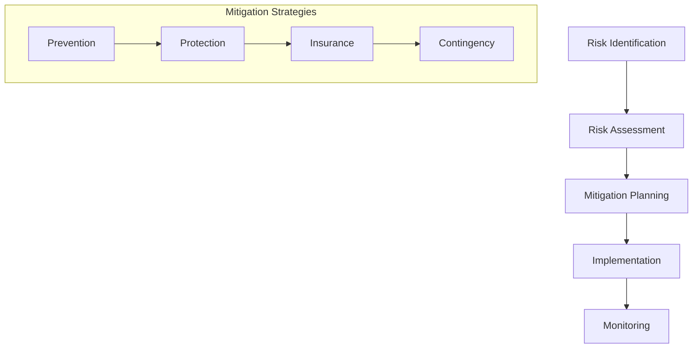

## Strategic Planning Framework {#strategic}

### 1. Long-Term Planning Matrix

```plaintext
Planning Horizons:
1. Strategic (5-10 years)
   - Market positioning
   - Technology roadmap
   - Capacity planning
   - Investment strategy

2. Tactical (2-5 years)
   - Process improvement
   - Equipment upgrades
   - Skill development
   - Quality enhancement

3. Operational (1-2 years)
   - Production targets
   - Efficiency goals
   - Training programs
   - Maintenance schedules
```

## Business Continuity {#continuity}

### 1. Continuity Planning Framework

```plaintext
A. Critical Systems Protection
1. Production Systems
   - Backup power: N+1 redundancy
   - Water systems: 72-hour backup
   - Compressed air: Dual systems
   - HVAC: Redundant units

2. IT Systems
   - Data backup: Real-time replication
   - Server redundancy: Hot standby
   - Network: Dual providers
   - Security: Multi-layer protection

3. Quality Systems
   - Lab equipment backup
   - Testing redundancy
   - Document preservation
   - Sample retention

B. Recovery Time Objectives
Jewelry Manufacturing:
- Critical processes: 24 hours
- Support systems: 48 hours
- Administrative: 72 hours

Chemical Manufacturing:
- Critical processes: 4 hours
- Support systems: 12 hours
- Administrative: 48 hours

Pharmaceutical Manufacturing:
- Critical processes: 2 hours
- Support systems: 8 hours
- Administrative: 24 hours
```

## Part 6: Human Resource Management & Organizational Development

## Table of Contents - Part 6
1. [Organizational Structure](#organization)
2. [Workforce Planning](#workforce)
3. [Training & Development](#training)
4. [Performance Management](#performance)
5. [Compensation & Benefits](#compensation)

## Organizational Structure {#organization}

### 1. Manufacturing Organization Design

```plaintext
A. Core Organizational Structure

Executive Level:
1. C-Suite
   - CEO/Managing Director
   - COO/Operations Director
   - Technical Director
   - Quality Director
   - Finance Director

2. Senior Management
   - Production Manager
   - Quality Manager
   - Engineering Manager
   - Maintenance Manager
   - HR Manager

3. Middle Management
   - Shift Supervisors
   - Team Leaders
   - Technical Specialists
   - Quality Controllers
   - Process Engineers

B. Support Functions
1. Technical Support
   - Process Development
   - Quality Assurance
   - Validation
   - Documentation

2. Administrative Support
   - HR Operations
   - Finance & Accounting
   - IT Support
   - Facilities Management
```

### 2. Staffing Requirements

```plaintext
A. Jewelry Manufacturing
1. Production Staff (per 100 units/day)
   - Master craftsmen: 5-8
   - Skilled workers: 15-20
   - Quality inspectors: 3-5
   - Support staff: 5-8

2. Technical Staff
   - Design engineers: 2-3
   - Process engineers: 1-2
   - Quality specialists: 2-3
   - Maintenance technicians: 2-4

3. Management Staff
   - Production managers: 1-2
   - Quality manager: 1
   - Technical manager: 1
   - Support managers: 2-3

B. Chemical Manufacturing
1. Production Staff (per shift)
   - Process operators: 8-12
   - Control room operators: 3-4
   - Laboratory technicians: 4-6
   - Maintenance staff: 4-6

2. Technical Staff
   - Process engineers: 3-4
   - Safety officers: 2-3
   - Quality analysts: 4-5
   - Environmental specialists: 2-3

3. Management Staff
   - Production manager: 1
   - Technical manager: 1
   - Safety manager: 1
   - Quality manager: 1

C. Pharmaceutical Manufacturing
1. Production Staff (per clean room)
   - Operators: 10-15
   - Quality inspectors: 4-6
   - Technical support: 3-4
   - Cleaning specialists: 4-6

2. Technical Staff
   - Validation engineers: 4-5
   - Quality assurance: 6-8
   - Documentation specialists: 3-4
   - Laboratory analysts: 8-10

3. Management Staff
   - Production manager: 1
   - Quality manager: 1
   - Validation manager: 1
   - Regulatory manager: 1
```

## Workforce Planning {#workforce}

### 1. Skill Requirements Matrix

```plaintext
A. Technical Skills Requirements

Jewelry Manufacturing:
1. Master Craftsman
   - Experience: 10+ years
   - Certifications: GIA/IGI
   - Specializations: 2-3 areas
   - Design software: CAD/CAM

2. Quality Inspector
   - Experience: 5+ years
   - Gemological training
   - Testing certification
   - Documentation skills

Chemical Manufacturing:
1. Process Engineer
   - Education: Chemical Engineering
   - Experience: 8+ years
   - Safety certifications
   - Process optimization

2. Control Room Operator
   - Education: Technical degree
   - Experience: 5+ years
   - DCS certification
   - Safety training

Pharmaceutical Manufacturing:
1. Production Specialist
   - Education: Life Sciences
   - GMP experience: 5+ years
   - Aseptic processing
   - Validation knowledge

2. Quality Assurance
   - Education: Pharmacy/Chemistry
   - Experience: 8+ years
   - Regulatory knowledge
   - Audit experience
```

### 2. Training Requirements

```plaintext
A. Mandatory Training Programs

1. Basic Training (All Industries)
   - Safety fundamentals: 40 hours
   - Quality basics: 24 hours
   - GMP introduction: 16 hours
   - Documentation: 8 hours

2. Advanced Training

Jewelry Manufacturing:
- Craftsmanship: 240 hours
- Design software: 80 hours
- Quality inspection: 120 hours
- Security procedures: 40 hours

Chemical Manufacturing:
- Process safety: 160 hours
- Equipment operation: 200 hours
- Emergency response: 80 hours
- Environmental management: 120 hours

Pharmaceutical Manufacturing:
- GMP advanced: 160 hours
- Aseptic technique: 200 hours
- Validation: 160 hours
- Quality systems: 240 hours
```

## Performance Management {#performance}

### 1. KPI Framework

```plaintext
A. Production KPIs

1. Efficiency Metrics
   - OEE target: >85%
   - Yield: >95%
   - Productivity: +5% YoY
   - Downtime: <5%

2. Quality Metrics
   - First pass yield: >90%
   - Customer complaints: <1%
   - Defect rate: <0.1%
   - Documentation accuracy: >99%

3. Safety Metrics
   - Incident rate: <1 per 200,000 hours
   - Near miss reporting: >90%
   - Training compliance: 100%
   - Safety audit score: >95%

B. Individual Performance Metrics

1. Technical Staff
   - Project completion: >90%
   - Documentation quality: >95%
   - Training completion: 100%
   - Innovation contribution: 2+ per year

2. Quality Staff
   - Inspection accuracy: >98%
   - Response time: <24 hours
   - Documentation compliance: 100%
   - System improvements: 4+ per year
```

## Part 7: Advanced HR Systems & Compensation

## Table of Contents - Part 7
1. [Compensation & Benefits Systems](#compensation)
2. [Employee Development](#development)
3. [Succession Planning](#succession)
4. [Industrial Relations](#industrial)
5. [HR Technology](#technology)

## Compensation & Benefits Systems {#compensation}

### 1. Salary Structure Framework

```plaintext
A. Base Salary Ranges (Annual, USD)

Executive Level:
1. C-Suite
   - CEO/MD: $180,000 - $400,000
   - COO: $150,000 - $300,000
   - Technical Director: $130,000 - $250,000
   - Quality Director: $120,000 - $230,000

2. Senior Management
   - Plant Manager: $100,000 - $180,000
   - Production Manager: $90,000 - $150,000
   - Quality Manager: $85,000 - $140,000
   - Engineering Manager: $90,000 - $160,000

3. Middle Management
   - Shift Managers: $65,000 - $95,000
   - Department Heads: $60,000 - $90,000
   - Technical Specialists: $55,000 - $85,000

Technical Staff:
1. Jewelry Manufacturing
   - Master Craftsman: $50,000 - $80,000
   - Senior Designer: $45,000 - $70,000
   - Quality Specialist: $40,000 - $65,000

2. Chemical Manufacturing
   - Process Engineer: $65,000 - $95,000
   - Safety Officer: $55,000 - $80,000
   - Lab Manager: $60,000 - $90,000

3. Pharmaceutical Manufacturing
   - Validation Engineer: $70,000 - $100,000
   - QA Manager: $75,000 - $110,000
   - Compliance Specialist: $65,000 - $95,000

B. Variable Compensation

1. Performance Bonus Structure
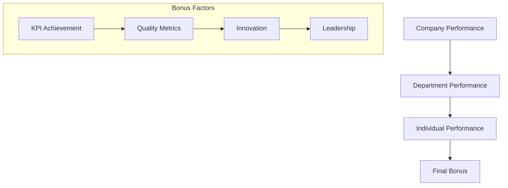

```plaintext
Bonus Calculation:
Base Bonus = Base Salary × Target Percentage
Final Bonus = Base Bonus × (Company Factor × 0.3 + 
              Department Factor × 0.3 + 
              Individual Factor × 0.4)

Target Percentages:
- Executive: 30-50%
- Senior Management: 20-30%
- Middle Management: 15-20%
- Technical Staff: 10-15%
- Support Staff: 5-10%
```

### 2. Benefits Package

```plaintext
A. Core Benefits
1. Insurance Coverage
   - Medical: 100% employee, 75% dependents
   - Dental: 80% coverage
   - Vision: 80% coverage
   - Life Insurance: 2× annual salary
   - Disability: Short & Long term

2. Retirement Benefits
   - 401(k) matching: 100% up to 6%
   - Pension plan (where applicable)
   - Retirement counseling
   - Early retirement options

3. Leave Benefits
   - Annual Leave: 15-25 days
   - Sick Leave: 10-15 days
   - Personal Days: 3-5 days
   - Training Leave: 5-10 days

B. Industry-Specific Benefits

1. Jewelry Manufacturing
   - Employee purchase program: 30-50% discount
   - Design royalties: 2-5% of sales
   - Skill premium: $200-500/month
   - Tools allowance: $1000/year

2. Chemical Manufacturing
   - Hazard pay: 15-25% premium
   - Safety bonus: $2000/year
   - Extended health coverage
   - Additional life insurance

3. Pharmaceutical Manufacturing
   - Research bonus: Up to 20%
   - Patent royalties: 1-3%
   - Publication incentives
   - Conference allowance
```

## Employee Development Programs {#development}

### 1. Career Development Framework

```plaintext
A. Technical Career Path

1. Entry Level Programs
   Duration: 12-24 months
   Components:
   - Technical training: 60%
   - Soft skills: 20%
   - Project work: 20%
   
   Investment per employee:
   - Training cost: $15,000-25,000
   - Materials: $5,000-8,000
   - Certification: $3,000-5,000

2. Advanced Development
   Duration: 24-36 months
   Components:
   - Specialization: 50%
   - Leadership: 25%
   - Innovation: 25%
   
   Investment per employee:
   - Advanced training: $30,000-50,000
   - Certifications: $10,000-15,000
   - Project funding: $20,000-30,000

B. Management Development

1. Leadership Pipeline
   Phases:
   - Managing Self
   - Managing Others
   - Managing Managers
   - Managing Function
   - Managing Business

2. Competency Development
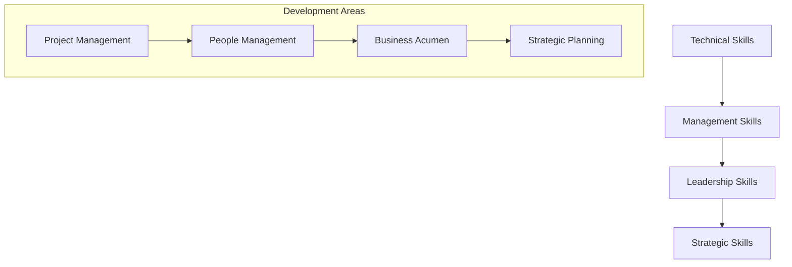

### 2. Training Matrix

```plaintext
A. Required Training Hours

1. Technical Staff
   Annual Requirements:
   - Core technical: 80 hours
   - Safety: 40 hours
   - Quality: 40 hours
   - Soft skills: 40 hours

2. Management Staff
   Annual Requirements:
   - Leadership: 60 hours
   - Technical updates: 40 hours
   - Compliance: 30 hours
   - Strategy: 30 hours

B. Training Budget Allocation

Per Employee Annual Budget:
1. Technical Staff
   - Basic: $5,000-8,000
   - Advanced: $8,000-12,000
   - Expert: $12,000-20,000

2. Management Staff
   - Junior: $8,000-12,000
   - Middle: $12,000-18,000
   - Senior: $18,000-25,000
```

## Part 8: Industrial Relations & Advanced HR Systems

## Table of Contents - Part 8
1. [Industrial Relations Framework](#industrial)
2. [HR Technology Systems](#technology)
3. [Compliance & Reporting](#compliance)
4. [Performance Analytics](#analytics)
5. [Future Trends](#trends)

## Industrial Relations Framework {#industrial}

### 1. Labor Relations Structure

```plaintext
A. Union Relations Management

1. Agreement Framework
   Collective Bargaining Components:
   - Base wage rates
   - Working hours
   - Overtime rules
   - Benefits structure
   - Grievance procedures
   
   Negotiation Cycle:
   - Preparation: 3-6 months
   - Negotiation: 1-3 months
   - Implementation: 1-2 months
   - Monitoring: Continuous

2. Industry-Specific Considerations

Jewelry Manufacturing:
- Skilled labor protection
- Craft preservation
- Training requirements
- Quality standards

Chemical Manufacturing:
- Safety protocols
- Hazard pay
- Shift arrangements
- Emergency procedures

Pharmaceutical Manufacturing:
- GMP compliance
- Clean room protocols
- Qualification requirements
- Quality standards
```

### 2. Workplace Relations

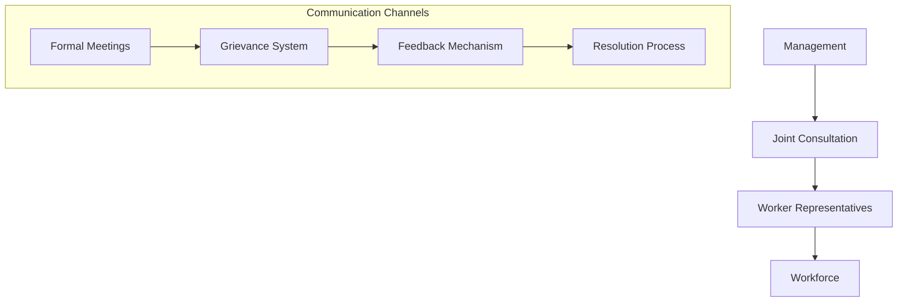

```plaintext
A. Communication Structure

1. Regular Forums
   - Monthly management meetings
   - Quarterly town halls
   - Annual strategic sessions
   - Weekly team briefings

2. Grievance Management
   - First level: Supervisor (24 hours)
   - Second level: Department Head (3 days)
   - Third level: HR/Union (7 days)
   - Final level: Management (14 days)

3. Performance Dialogue
   - Individual: Monthly
   - Team: Weekly
   - Department: Monthly
   - Organization: Quarterly
```

## HR Technology Systems {#technology}

### 1. Integrated HR Systems Architecture

```plaintext
A. Core HR Management System

1. Personnel Management
   - Employee database
   - Position management
   - Organization structure
   - Document management
   
   System Requirements:
   - Database: Oracle/SQL
   - Storage: 100GB/1000 employees
   - Backup: Real-time
   - Access control: Role-based

2. Time & Attendance
   - Biometric integration
   - Shift management
   - Overtime calculation
   - Leave management
   
   Hardware Requirements:
   - Biometric readers: 1 per 50 employees
   - Time clocks: 1 per 100 employees
   - Backup systems: N+1 redundancy

3. Payroll Integration
   - Salary processing
   - Tax calculation
   - Benefits administration
   - Statutory compliance
```

### 2. Advanced HR Analytics

```plaintext
A. Analytics Framework

1. Workforce Analytics
   Key Metrics:
   - Headcount trends
   - Turnover analysis
   - Cost per hire
   - Time to fill
   
   Reporting Frequency:
   - Daily: Attendance
   - Weekly: Production metrics
   - Monthly: Cost analysis
   - Quarterly: Strategic metrics

2. Performance Analytics
   Measurement Areas:
   - Productivity metrics
   - Quality indicators
   - Safety performance
   - Training effectiveness
   
   Analysis Tools:
   - Predictive modeling
   - Trend analysis
   - Comparative benchmarking
   - ROI calculation
```

### 3. HR Technology Investment

```plaintext
A. System Implementation Costs

1. Basic HRMS
   - Software license: $500-1000/user
   - Implementation: $100,000-300,000
   - Annual maintenance: 18-22% of license
   - Training: $200-500/user

2. Advanced Modules
   - Talent management: $200-400/user
   - Learning management: $150-300/user
   - Performance management: $100-250/user
   - Analytics: $150-300/user

B. ROI Calculations

1. Cost Savings
   - Paper reduction: 80-90%
   - Process time: 40-60%
   - Error reduction: 70-80%
   - Reporting time: 50-70%

2. Productivity Gains
   - HR staff efficiency: +30-40%
   - Manager efficiency: +20-30%
   - Employee self-service: +60-70%
   - Data accuracy: +90-95%
```

## Compliance & Reporting {#compliance}

### 1. Regulatory Compliance Framework

```plaintext
A. Compliance Requirements

1. Basic Compliance
   - Labor laws
   - Safety regulations
   - Equal opportunity
   - Privacy protection
   
   Documentation:
   - Policy manuals
   - Procedure guides
   - Training records
   - Audit reports

2. Industry-Specific Compliance

Jewelry Manufacturing:
- Precious metals handling
- Security protocols
- Craftsman certification
- Quality standards

Chemical Manufacturing:
- OSHA compliance
- Environmental regulations
- Hazardous materials
- Emergency procedures

Pharmaceutical Manufacturing:
- GMP requirements
- FDA regulations
- Clean room protocols
- Validation documentation
```

### 2. Reporting Systems

```plaintext
A. Statutory Reporting

1. Government Reports
   Frequency: Monthly/Quarterly/Annual
   Content:
   - Employment statistics
   - Safety records
   - Training compliance
   - Environmental impact

2. Industry Reports
   Frequency: As required
   Content:
   - Production metrics
   - Quality standards
   - Compliance status
   - Incident reports

B. Management Reporting

1. Executive Dashboard
   Update: Daily/Weekly
   Metrics:
   - Workforce status
   - Production efficiency
   - Cost analysis
   - Compliance status

2. Operational Reports
   Frequency: Daily/Weekly
   Content:
   - Attendance
   - Production metrics
   - Quality indicators
   - Safety statistics
```

## Part 9: Digital Transformation & Future HR Trends

## Table of Contents - Part 9
1. [Digital HR Transformation](#digital)
2. [AI & Machine Learning](#ai-ml)
3. [Future Workforce Planning](#future)
4. [ESG & Sustainability](#sustainability)
5. [Global HR Management](#global)

## Digital HR Transformation {#digital}

### 1. Digital HR Architecture

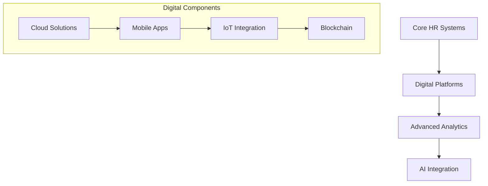

### 2. Implementation Framework

```plaintext
A. Digital Transformation Roadmap

1. Infrastructure Setup
   Investment Requirements:
   - Cloud infrastructure: $200K-500K
   - Security systems: $100K-300K
   - Integration platforms: $150K-400K
   - Mobile solutions: $100K-250K

2. System Components

Core Systems:
- Cloud HRMS: $1000-2000/user/year
- Analytics platform: $500-1000/user/year
- Mobile apps: $200-400/user/year
- Integration tools: $300-600/user/year

Advanced Features:
- AI modules: $500-1000/user/year
- Blockchain solutions: $400-800/user/year
- IoT integration: $300-600/user/year
```

## AI & Machine Learning {#ai-ml}

### 1. AI Applications in HR

```plaintext
A. Recruitment & Selection

1. AI-Powered Recruiting
   Components:
   - Resume screening
   - Candidate matching
   - Interview scheduling
   - Assessment analysis
   
   Expected ROI:
   - Time reduction: 60-70%
   - Cost savings: 40-50%
   - Quality improvement: 30-40%
   - Candidate experience: +50%

2. Predictive Analytics
   Applications:
   - Turnover prediction
   - Performance forecasting
   - Skill gap analysis
   - Succession planning
   
   Accuracy Levels:
   - Turnover prediction: 85-90%
   - Performance prediction: 80-85%
   - Skill matching: 75-80%
```

### 2. Machine Learning Systems

```plaintext
A. Learning & Development

1. Adaptive Learning Systems
   Features:
   - Personalized learning paths
   - Skill assessment
   - Progress tracking
   - Content recommendation
   
   Investment Requirements:
   - Platform setup: $200K-400K
   - Content development: $100K-300K
   - Integration: $50K-150K
   - Maintenance: 20% annually

2. Performance Management
   Components:
   - Real-time feedback
   - Performance analytics
   - Goal tracking
   - Development planning
   
   System Requirements:
   - Processing power: High
   - Storage: Cloud-based
   - Integration: API-driven
   - Security: Enterprise-grade
```

## Future Workforce Planning {#future}

### 1. Workforce Evolution Model

```plaintext
A. Skill Transformation

1. Current to Future Skills Mapping
   Manufacturing Skills:
   - Traditional: 60% declining
   - Digital: 80% growing
   - Hybrid: 100% emerging
   
   Investment in Reskilling:
   - Technical: $5000-8000/employee
   - Digital: $3000-6000/employee
   - Soft skills: $2000-4000/employee

2. Future Role Analysis
   Emerging Roles:
   - Digital Process Manager
   - AI Operations Specialist
   - Robot Coordinator
   - Data Quality Manager
   
   Skill Requirements:
   - Digital literacy: Advanced
   - AI understanding: Intermediate
   - Data analytics: Advanced
   - Change management: Expert
```

### 2. Organization Structure Evolution

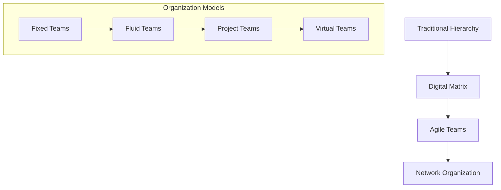

## ESG & Sustainability {#sustainability}

### 1. ESG Integration in HR

```plaintext
A. Sustainability Metrics

1. Environmental Impact
   Measurements:
   - Carbon footprint/employee
   - Resource utilization
   - Waste reduction
   - Green initiatives
   
   Targets:
   - Carbon reduction: 50% by 2030
   - Zero waste: 2035
   - Renewable energy: 100% by 2040

2. Social Impact
   Focus Areas:
   - Diversity & inclusion
   - Community engagement
   - Employee wellbeing
   - Ethical practices
   
   Investment:
   - D&I programs: $500-1000/employee
   - Community programs: 1% of revenue
   - Wellbeing initiatives: $300-600/employee
```

### 2. Sustainable HR Practices

```plaintext
A. Implementation Framework

1. Policy Development
   Components:
   - Green workplace
   - Sustainable benefits
   - Ethical sourcing
   - Social responsibility
   
   Documentation:
   - Policy manuals
   - Guidelines
   - Metrics
   - Reports

2. Performance Integration
   Metrics:
   - ESG objectives
   - Sustainability KPIs
   - Social impact
   - Environmental goals
   
   Rewards:
   - ESG bonus: 5-10% of variable pay
   - Sustainability awards
   - Recognition programs
```

## Global HR Management {#global}

### 1. Global Operations Framework

```plaintext
A. Global Structure

1. Regional Operations
   Organization:
   - Global HQ
   - Regional centers
   - Local units
   - Shared services
   
   Investment per Region:
   - Setup: $1M-3M
   - Operations: $500K-1.5M/year
   - Technology: $200K-500K/year
   - Compliance: $300K-800K/year

2. Standardization
   Areas:
   - Core policies
   - Systems
   - Processes
   - Reporting
   
   Implementation:
   - Planning: 6-12 months
   - Rollout: 12-24 months
   - Stabilization: 6-12 months
```

## Part 10: Advanced Global HR Strategies & Innovation

## Table of Contents - Part 10
1. [Advanced Global HR Strategies](#global)
2. [Manufacturing HR Innovation](#innovation)
3. [Next Generation Workforce](#nextgen)
4. [Change Management](#change)
5. [Future Integration](#future)

## Advanced Global HR Strategies {#global}

### 1. Global Talent Management

```plaintext
A. Global Talent Pipeline

1. International Recruitment
   Investment per Market:
   - Talent mapping: $50K-100K
   - Recruitment tools: $30K-80K
   - Assessment centers: $40K-90K
   - Onboarding: $20K-50K

2. Global Mobility Program
   Components:
   - Assignment types
     * Short-term: 3-12 months
     * Long-term: 1-5 years
     * Permanent transfer
   
   Cost Structure:
   - Relocation: $20K-100K
   - Housing: $2K-10K/month
   - Education: $10K-40K/year
   - Tax equalization: 30-40% premium
```

### 2. Global Compensation Strategy

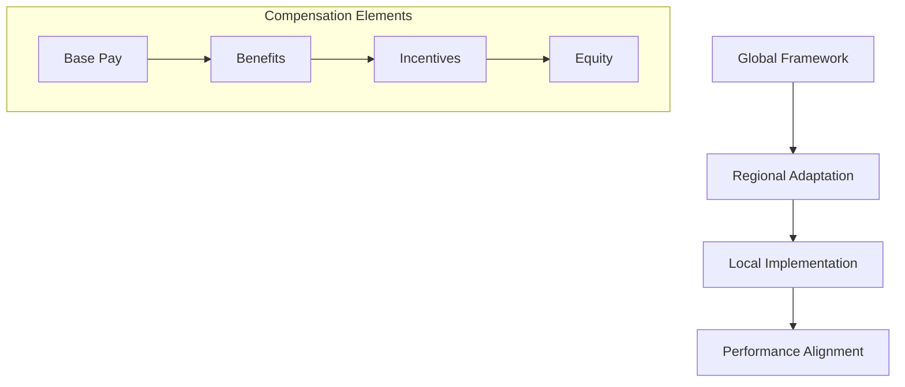

```plaintext
A. Global Pay Structure

1. Base Salary Positioning
   Market Positioning:
   - Mature markets: 50-75th percentile
   - Emerging markets: 75-90th percentile
   - Strategic markets: 90th percentile+

2. Global Benefits
   Core Benefits:
   - Healthcare: $5K-15K/employee
   - Retirement: 5-15% of base
   - Insurance: 2-5% of base
   - Wellness: $1K-3K/employee
```

## Manufacturing HR Innovation {#innovation}

### 1. Advanced Manufacturing HR Systems

```plaintext
A. Smart Factory HR

1. Digital Integration
   Components:
   - IoT workforce tracking
   - AR/VR training systems
   - AI performance monitoring
   - Robotics collaboration
   
   Investment Requirements:
   - Infrastructure: $500K-2M
   - Software: $200K-800K
   - Training: $100K-400K
   - Maintenance: 20% annually

2. Advanced Analytics Platform
   Features:
   - Real-time productivity
   - Predictive safety
   - Quality correlation
   - Skills analytics
   
   ROI Metrics:
   - Productivity gain: 20-30%
   - Safety incident reduction: 40-60%
   - Quality improvement: 30-50%
   - Training efficiency: 40-60%
```

### 2. Innovation Labs

```plaintext
A. HR Innovation Centers

1. Research & Development
   Focus Areas:
   - Workforce analytics
   - Process automation
   - Training innovation
   - Employee experience
   
   Annual Budget:
   - Research: $300K-1M
   - Prototyping: $200K-800K
   - Testing: $150K-500K
   - Implementation: $250K-1M

2. Technology Integration
   Priority Areas:
   - AI/ML applications
   - Blockchain for HR
   - IoT integration
   - Extended reality (XR)
   
   Investment Timeline:
   - Planning: 3-6 months
   - Development: 6-12 months
   - Testing: 3-6 months
   - Rollout: 6-12 months
```

## Next Generation Workforce {#nextgen}

### 1. Future Workforce Planning

```plaintext
A. Skill Evolution Matrix

1. Technical Skills 2025+
   Manufacturing Skills:
   - Digital twin management
   - Robotic process control
   - AI systems monitoring
   - Smart maintenance
   
   Required Investment:
   - Technical training: $8K-15K/employee
   - Certification: $5K-10K/employee
   - Tools & software: $3K-8K/employee

2. Soft Skills 2025+
   Priority Areas:
   - Digital collaboration
   - Virtual leadership
   - Innovation mindset
   - Change adaptability
   
   Development Programs:
   - Leadership: $10K-20K/person
   - Innovation: $5K-15K/person
   - Digital skills: $3K-8K/person
```

### 2. Workforce Structure Evolution

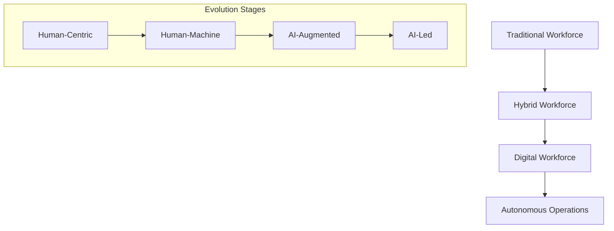

## Change Management {#change}

### 1. Digital Transformation Management

```plaintext
A. Change Framework

1. Transformation Phases
   Implementation:
   - Assessment: 2-3 months
   - Planning: 3-4 months
   - Execution: 12-18 months
   - Stabilization: 6-12 months
   
   Investment per Phase:
   - Assessment: $100K-300K
   - Planning: $200K-500K
   - Execution: $1M-3M
   - Stabilization: $500K-1M

2. Change Support Structure
   Components:
   - Change champions
   - Digital coaches
   - Training specialists
   - Support teams
   
   Resource Requirements:
   - 1 champion per 50 employees
   - 1 coach per 100 employees
   - 1 trainer per 200 employees
```

## Future Integration {#future}

### 1. Advanced Integration Systems

```plaintext
A. System Architecture 2025+

1. Core Systems Integration
   Components:
   - AI-driven HRMS
   - Blockchain records
   - IoT workforce data
   - XR training platforms
   
   Investment Timeline:
   - 2024-2025: $2M-5M
   - 2026-2027: $3M-7M
   - 2028-2029: $4M-9M
   - 2030+: $5M-10M

2. Data Architecture
   Structure:
   - Real-time analytics
   - Predictive modeling
   - AI decision support
   - Autonomous systems
   
   Data Requirements:
   - Processing: Edge computing
   - Storage: Hybrid cloud
   - Security: Quantum-safe
   - Integration: API-first
```

# Panduan Implementasi & Struktur Biaya Odoo
## Untuk Industri Manufaktur di Indonesia

## Table of Contents
1. [Struktur Biaya Implementasi](#biaya)
2. [Kebutuhan Infrastruktur](#infrastruktur)
3. [Sumber Daya Manusia](#sdm)
4. [Timeline Implementasi](#timeline)
5. [ROI & Maintenance](#roi)

## Struktur Biaya Implementasi {#biaya}

### 1. Skala Implementasi

```plaintext
A. Implementasi Skala Kecil (10-50 pengguna)

1. Biaya Lisensi
   - Enterprise: Rp 7-12 juta/tahun/user
   - Community: Gratis (limited feature)
   
2. Biaya Implementasi
   - Konsultasi: Rp 150-300 juta
   - Kustomisasi: Rp 200-400 juta
   - Training: Rp 50-100 juta
   - Data Migration: Rp 50-150 juta
   
   Total Investasi Awal: Rp 450-950 juta

B. Implementasi Skala Menengah (50-200 pengguna)

1. Biaya Lisensi
   - Enterprise: Rp 5-10 juta/tahun/user
   - Server Dedicated: Rp 150-300 juta
   
2. Biaya Implementasi
   - Konsultasi: Rp 300-600 juta
   - Kustomisasi: Rp 400-800 juta
   - Training: Rp 100-200 juta
   - Data Migration: Rp 150-300 juta
   
   Total Investasi Awal: Rp 950-1.9 miliar

C. Implementasi Skala Besar (200+ pengguna)

1. Biaya Lisensi
   - Enterprise: Rp 4-8 juta/tahun/user
   - Server Infrastructure: Rp 300-600 juta
   
2. Biaya Implementasi
   - Konsultasi: Rp 600 juta - 1.2 miliar
   - Kustomisasi: Rp 800 juta - 1.5 miliar
   - Training: Rp 200-400 juta
   - Data Migration: Rp 300-600 juta
   
   Total Investasi Awal: Rp 1.9-3.7 miliar
```

### 2. Breakdown Biaya Detail

```plaintext
A. Komponen Biaya Implementasi

1. Analisis & Desain
   - Business Process Analysis: 15-20% total
   - System Design: 10-15% total
   - Gap Analysis: 5-10% total
   - Documentation: 5-8% total

2. Pengembangan
   - Core Development: 25-30% total
   - Customization: 15-20% total
   - Integration: 10-15% total
   - Testing: 8-12% total

3. Deployment
   - Installation: 5-8% total
   - Data Migration: 10-15% total
   - Training: 8-12% total
   - Go-Live Support: 5-10% total

B. Biaya Berdasarkan Modul

1. Manufacturing
   Basic Setup: Rp 300-500 juta
   - Production planning
   - Quality control
   - Inventory management
   - Cost accounting
   
   Advanced Features: +Rp 200-400 juta
   - Advanced planning
   - Maintenance management
   - Quality management
   - Batch tracking

2. Accounting & Finance
   Basic Setup: Rp 200-400 juta
   - General ledger
   - Accounts payable
   - Accounts receivable
   - Asset management
   
   Advanced Features: +Rp 150-300 juta
   - Cost center accounting
   - Budget management
   - Financial analytics
   - Tax management
```

### 3. Infrastruktur Requirements

```plaintext
A. Hardware Requirements

1. Server Requirements (On-Premise)
   
   Small Scale:
   - Server: Rp 150-300 juta
   - Storage: Rp 50-100 juta
   - Networking: Rp 30-60 juta
   - Backup: Rp 20-40 juta

   Medium Scale:
   - Server: Rp 300-600 juta
   - Storage: Rp 100-200 juta
   - Networking: Rp 60-120 juta
   - Backup: Rp 40-80 juta

   Large Scale:
   - Server: Rp 600 juta - 1.2 miliar
   - Storage: Rp 200-400 juta
   - Networking: Rp 120-240 juta
   - Backup: Rp 80-160 juta

2. Cloud Requirements (Annual)
   
   Small Scale:
   - Cloud Server: Rp 60-120 juta/tahun
   - Bandwidth: Rp 24-48 juta/tahun
   - Backup: Rp 12-24 juta/tahun

   Medium Scale:
   - Cloud Server: Rp 120-240 juta/tahun
   - Bandwidth: Rp 48-96 juta/tahun
   - Backup: Rp 24-48 juta/tahun

   Large Scale:
   - Cloud Server: Rp 240-480 juta/tahun
   - Bandwidth: Rp 96-192 juta/tahun
   - Backup: Rp 48-96 juta/tahun
```

### 4. SDM Requirements

```plaintext
A. Tim Implementasi Internal

1. Core Team (Minimal)
   - Project Manager: Rp 25-40 juta/bulan
   - Business Analyst: Rp 15-25 juta/bulan
   - Technical Lead: Rp 20-35 juta/bulan
   - Quality Assurance: Rp 12-20 juta/bulan

2. Support Team
   - System Admin: Rp 12-20 juta/bulan
   - Database Admin: Rp 15-25 juta/bulan
   - Network Engineer: Rp 12-20 juta/bulan
   - Help Desk: Rp 8-15 juta/bulan

B. Ongoing Support

1. Maintenance Team
   - Technical Support: 2-3 orang
   - Business Support: 1-2 orang
   - Total Budget: Rp 50-100 juta/bulan

2. Training & Development
   - Initial Training: Rp 5-10 juta/peserta
   - Ongoing Training: Rp 2-5 juta/peserta/tahun
```

### 5. Timeline & Milestone Payments

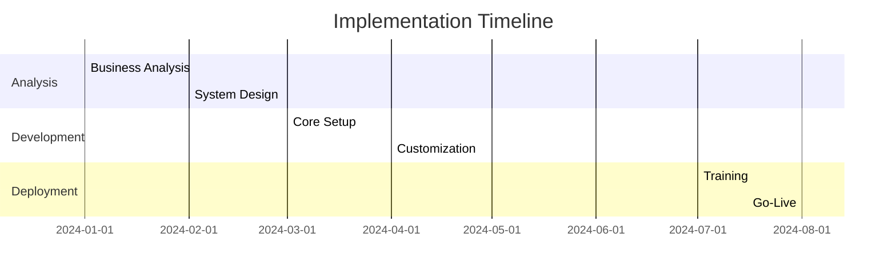

```plaintext
Payment Schedule:

1. Project Initiation: 20%
   - Contract signing
   - Initial analysis
   - Project planning

2. Development Phase: 40%
   - Core setup: 15%
   - Customization: 15%
   - Integration: 10%

3. Implementation: 30%
   - Training: 10%
   - Data migration: 10%
   - Go-live: 10%

4. Post Go-Live: 10%
   - Support
   - Optimization
   - Documentation
```

### 6. ROI Calculations

```plaintext
Expected Benefits:

1. Efisiensi Operasional
   - Reduksi waktu proses: 40-60%
   - Pengurangan error: 50-70%
   - Peningkatan produktivitas: 20-30%

2. Penghematan Biaya
   - Inventory carrying cost: -20-30%
   - Labor cost: -15-25%
   - Operational cost: -10-20%

3. Revenue Impact
   - Peningkatan akurasi: +15-25%
   - Customer satisfaction: +20-30%
   - Time-to-market: -30-40%

ROI Timeline:
- Break-even: 18-24 bulan
- ROI 3 tahun: 150-200%
- ROI 5 tahun: 250-300%
```

# Advanced Manufacturing Knowledge Base
## Hidden Aspects & Critical Success Factors

## Table of Contents
1. [Critical Success Factors](#critical)
2. [Hidden Costs & Considerations](#hidden)
3. [Industry-Specific Challenges](#challenges)
4. [Advanced Integration Points](#integration)
5. [Risk Mitigation Strategies](#risks)

## Critical Success Factors {#critical}

### 1. Pre-Implementation Essentials

```plaintext
A. Business Process Maturity Assessment

1. Process Documentation
   Required Components:
   - Standard Operating Procedures
   - Work Instructions
   - Quality Manual
   - Control Plans
   
   Common Pitfalls:
   - Undocumented tribal knowledge: 40% of processes
   - Outdated procedures: 30% of documentation
   - Missing control points: 25% of processes
   - Informal workarounds: 35% of operations

2. Data Readiness Assessment
   Key Areas:
   - Master data cleanliness: >95% required
   - Historical data accuracy: >90% required
   - Data structure alignment: >85% required
   - Integration readiness: >80% required
   
   Preparation Costs:
   - Data cleansing: Rp 100-200 juta
   - Structure reorganization: Rp 150-300 juta
   - Validation exercise: Rp 50-100 juta
```

### 2. Hidden Technical Requirements

```plaintext
A. Integration Complexity

1. Legacy Systems Integration
   Common Systems:
   - Custom-built solutions
   - Spreadsheet systems
   - Machine control systems
   - Quality systems
   
   Integration Costs:
   - Simple integration: Rp 50-100 juta/sistem
   - Medium complexity: Rp 100-300 juta/sistem
   - High complexity: Rp 300-600 juta/sistem

2. Machine Integration
   Requirements:
   - PLC integration
   - SCADA systems
   - IoT sensors
   - Real-time monitoring
   
   Investment Needs:
   - Hardware interface: Rp 20-50 juta/mesin
   - Software interface: Rp 30-80 juta/mesin
   - Integration labor: Rp 40-100 juta/mesin
```

### 3. Industry-Specific Requirements

```plaintext
A. Jewelry Manufacturing

1. Specialized Features
   - Precious metal tracking
   - Stone inventory
   - Design management
   - Certification tracking
   
   Additional Modules:
   - Design CAD integration: Rp 200-400 juta
   - Stone management: Rp 150-300 juta
   - Certification system: Rp 100-200 juta

2. Quality Control Points
   - Material testing
   - Design validation
   - Production inspection
   - Final certification
   
   System Requirements:
   - Testing equipment integration
   - Digital imaging system
   - Weight management
   - Certificate generation

B. Chemical Manufacturing

1. Process Control
   - Batch management
   - Formula control
   - Safety protocols
   - Environmental monitoring
   
   Additional Systems:
   - Lab information system: Rp 300-600 juta
   - Environmental monitoring: Rp 200-400 juta
   - Safety management: Rp 150-300 juta

2. Compliance Requirements
   - Material safety
   - Environmental reporting
   - Quality documentation
   - Batch traceability
   
   System Enhancements:
   - Document control: Rp 100-200 juta
   - Compliance reporting: Rp 150-300 juta
   - Audit management: Rp 100-200 juta

C. Pharmaceutical Manufacturing

1. GMP Compliance
   - Clean room monitoring
   - Validation system
   - Batch control
   - Quality assurance
   
   Additional Modules:
   - Validation system: Rp 400-800 juta
   - Quality management: Rp 300-600 juta
   - Document control: Rp 200-400 juta

2. Regulatory Requirements
   - FDA compliance
   - Batch documentation
   - Change control
   - Audit trail
   
   System Requirements:
   - Electronic batch record
   - Change management
   - Audit trail system
   - Document control
```

### 4. Advanced Integration Points

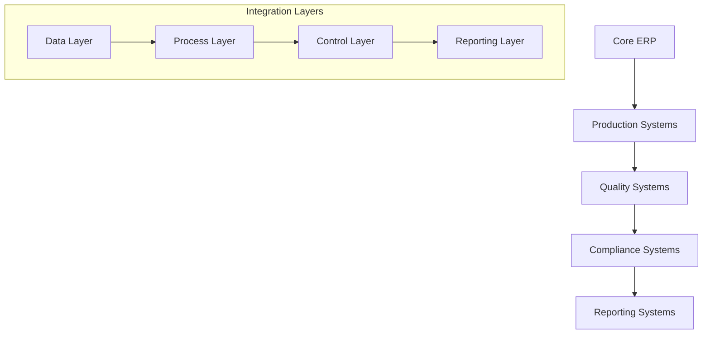

### 5. Hidden Cost Factors

```plaintext
A. Organizational Impact

1. Change Management
   Components:
   - Communication program: Rp 50-100 juta
   - Training materials: Rp 30-60 juta
   - Change support: Rp 100-200 juta
   - Resistance management: Rp 50-100 juta

2. Productivity Impact
   First 6 Months:
   - Productivity drop: 20-30%
   - Error increase: 30-40%
   - Process delays: 25-35%
   - Learning curve: 3-6 months

3. Hidden Infrastructure Costs
   - Power backup systems: Rp 200-400 juta
   - Environmental control: Rp 150-300 juta
   - Security systems: Rp 100-200 juta
   - Disaster recovery: Rp 300-600 juta
```

### 6. Critical Success Metrics

```plaintext
A. Implementation Success Factors

1. Process Metrics
   Key Indicators:
   - Process standardization: >90%
   - System utilization: >85%
   - Data accuracy: >95%
   - User adoption: >90%

2. Performance Metrics
   Critical Areas:
   - Production efficiency: +20-30%
   - Quality improvement: +15-25%
   - Cost reduction: 10-20%
   - Cycle time reduction: 30-40%

3. ROI Components
   Direct Benefits:
   - Inventory reduction: 20-30%
   - Labor efficiency: 15-25%
   - Quality cost reduction: 25-35%
   
   Indirect Benefits:
   - Customer satisfaction: +20-30%
   - Employee satisfaction: +15-25%
   - Market responsiveness: +25-35%
```

# Advanced Manufacturing Optimization & Integration Guide
## Comprehensive Technical & Operational Framework

## Table of Contents - Part 1
1. [Industry-Specific Optimization](#optimization)
2. [Advanced Integration Architecture](#integration)
3. [Performance Enhancement](#performance)
4. [Specialized Configurations](#config)
5. [Future-Proofing Strategies](#future)

## Industry-Specific Optimization {#optimization}

### 1. Jewelry Manufacturing Optimization

```plaintext
A. Production Optimization

1. Process Flow Optimization
   Key Areas:
   - Design to Production: -40% time
   - Material Flow: +35% efficiency
   - Quality Control: +45% accuracy
   
   Implementation Requirements:
   - CAD/CAM Integration: Rp 200-400 juta
   - Material tracking system: Rp 150-300 juta
   - Quality inspection system: Rp 100-250 juta

2. Advanced Planning Optimization
   Components:
   - Material requirements planning
   - Capacity planning
   - Resource scheduling
   - Order optimization
   
   System Enhancements:
   - Planning module: Rp 300-600 juta
   - Forecasting system: Rp 200-400 juta
   - Scheduling optimization: Rp 150-300 juta
```

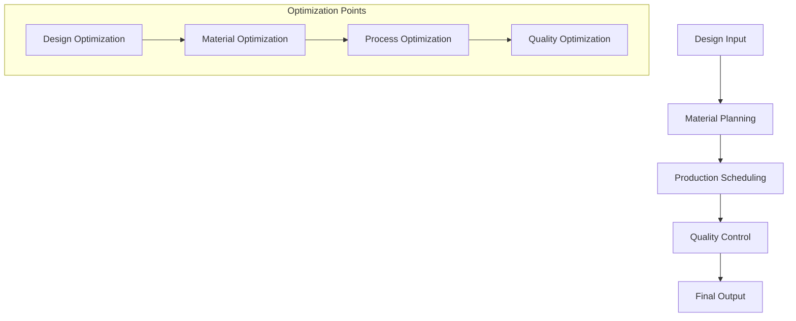

### 2. Chemical Manufacturing Optimization

```plaintext
A. Process Control Optimization

1. Batch Process Optimization
   Key Parameters:
   - Reaction efficiency: +25%
   - Yield optimization: +20%
   - Quality consistency: +30%
   - Waste reduction: -35%
   
   System Requirements:
   - Process control system: Rp 500-900 juta
   - Quality monitoring: Rp 300-600 juta
   - Waste management: Rp 200-400 juta

2. Resource Optimization
   Focus Areas:
   - Energy consumption: -30%
   - Raw material usage: -25%
   - Labor efficiency: +35%
   - Equipment utilization: +40%
   
   Implementation Costs:
   - Energy monitoring: Rp 250-500 juta
   - Material tracking: Rp 200-400 juta
   - Labor management: Rp 150-300 juta
```

### 3. Pharmaceutical Manufacturing Optimization

```plaintext
A. GMP-Compliant Optimization

1. Clean Room Optimization
   Parameters:
   - Environmental control: +40% precision
   - Contamination control: -60% risk
   - Process efficiency: +35%
   - Documentation accuracy: +50%
   
   System Requirements:
   - Environmental monitoring: Rp 400-800 juta
   - Contamination control: Rp 300-600 juta
   - Documentation system: Rp 200-400 juta

2. Validation Process Optimization
   Components:
   - Process validation
   - Cleaning validation
   - Method validation
   - Computer system validation
   
   Investment Needs:
   - Validation system: Rp 500-1000 juta
   - Documentation management: Rp 300-600 juta
   - Training system: Rp 200-400 juta
```

## Advanced Integration Architecture {#integration}

### 1. System Integration Framework

```plaintext
A. Enterprise Integration Architecture

1. Core Systems Integration
   Components:
   - ERP core modules
   - Manufacturing execution
   - Quality management
   - Warehouse management
   
   Integration Costs:
   - Core integration: Rp 400-800 juta
   - Module interfaces: Rp 300-600 juta
   - Data synchronization: Rp 200-400 juta

2. Extended Systems Integration
   Systems:
   - Customer portals
   - Supplier networks
   - Logistics systems
   - Compliance systems
   
   Implementation Requirements:
   - Portal development: Rp 300-600 juta
   - Network integration: Rp 250-500 juta
   - Compliance integration: Rp 200-400 juta
```

### 2. Data Integration Strategy

```plaintext
A. Data Architecture

1. Master Data Management
   Components:
   - Product master
   - Customer master
   - Vendor master
   - Process master
   
   Implementation Costs:
   - Data cleansing: Rp 150-300 juta
   - Structure setup: Rp 100-200 juta
   - Governance system: Rp 200-400 juta

2. Transaction Data Management
   Areas:
   - Production transactions
   - Quality data
   - Inventory movements
   - Financial transactions
   
   System Requirements:
   - Transaction processing: Rp 300-600 juta
   - Data warehouse: Rp 400-800 juta
   - Analytics system: Rp 200-400 juta
```

## Performance Enhancement {#performance}

### 1. System Performance Optimization

```plaintext
A. Infrastructure Optimization

1. Server Optimization
   Parameters:
   - Response time: <2 seconds
   - Transaction throughput: >100/second
   - Concurrent users: >500
   - Data processing: >1TB/day
   
   Investment Areas:
   - Server upgrades: Rp 300-600 juta
   - Storage optimization: Rp 200-400 juta
   - Network enhancement: Rp 150-300 juta

2. Database Optimization
   Focus Areas:
   - Query performance
   - Index optimization
   - Table partitioning
   - Cache management
   
   Implementation Costs:
   - Database tuning: Rp 200-400 juta
   - Performance monitoring: Rp 150-300 juta
   - Optimization tools: Rp 100-200 juta
```

[Continue with Specialized Configurations and Future-Proofing Strategies...]